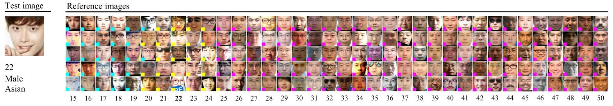
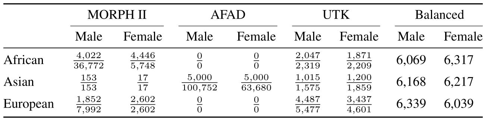
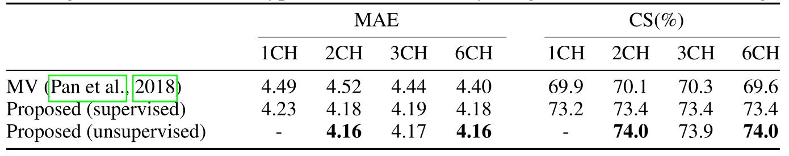

# [ICLR 2020] Order Learning and Its Application to Age Estimation

## Paper
[**Order Learning and Its Application to Age Estimation**](https://openreview.net/pdf?id=HygsuaNFwr)

We propose order learning to determine the order graph of classes, representing ranks or priorities, and classify an object instance into one of the classes. To this end, we design a pairwise comparator to categorize the relationship between two instances into one of three cases: one instance is 'greater than,' 'similar to,' or 'smaller than' the other. Then, by comparing an input instance with reference instances and maximizing the consistency among the comparison results, the class of the input can be estimated reliably. We apply order learning to develop a facial age estimator, which provides the state-of-the-art performance. Moreover, the performance is further improved when the order graph is divided into disjoint chains using gender and ethnic group information or even in an unsupervised manner.

Please cite our paper if you find our code and dataset are helpful for your research:
```
@inproceedings{
Lim2020Order,
title={Order Learning and Its Application to Age Estimation},
author={Kyungsun Lim and Nyeong-Ho Shin and Young-Yoon Lee and Chang-Su Kim},
booktitle={International Conference on Learning Representations},
year={2020},
url={https://openreview.net/forum?id=HygsuaNFwr}
}
```

## Code
Coming Soon

## Dataset
We form a ‘balanced dataset’ from MORPH II[1], AFAD[2], and UTK[3]. Before sampling images from MORPH II, AFAD, and UTK, we rectify inconsistent labels by following the strategy in [4]. For each combination of gender in {female, male} and ethnic group in {African, Asian, European}, we sample about 6,000 images. Also, during the sampling, we attempt to make the age distribution as uniform as possible within range [15,80]. The balanced dataset is partitioned into training and test subsets with ratio 8 : 2. 



You should download MORPH II, AFAD, and UTK dataset before using our balanced dataset.

Downloads links are followed:  
MORPH II[[Link](https://ebill.uncw.edu/C20231_ustores/web/classic/product_detail.jsp?PRODUCTID=8)]  AFAD[[Link](https://afad-dataset.github.io/)] UTK[[Link](https://susanqq.github.io/UTKFace/)]

## Results


## Reference
[1] Karl Ricanek and Tamirat Tesafaye. MORPH: A longitudinal image database of normal adult age-progression. In FGR, pp. 341–345, 2006.  
[2] Zhenxing Niu, Mo Zhou, Le Wang, Xinbo Gao, and Gang Hua. Ordinal regression with multiple output CNN for age estimation. In CVPR, pp. 4920–4928, 2016.  
[3] Zhifei Zhang, Yang Song, and Hairong Qi. Age progression/regression by conditional adversarial autoencoder. In CVPR, 2017b.  
[4] Benjamin Yip, Garrett Bingham, Katherine Kempfert, Jonathan Fabish, Troy Kling, Cuixian Chen, and Yishi Wang. Preliminary studies on a large face database. In ICBD, pp. 2572–2579, 2018.  
[5] Hongyu Pan, Hu Han, Shiguang Shan, and Xilin Chen. Mean-variance loss for deep age estimation from a face. In CVPR, pp. 5285–5294, 2018.
